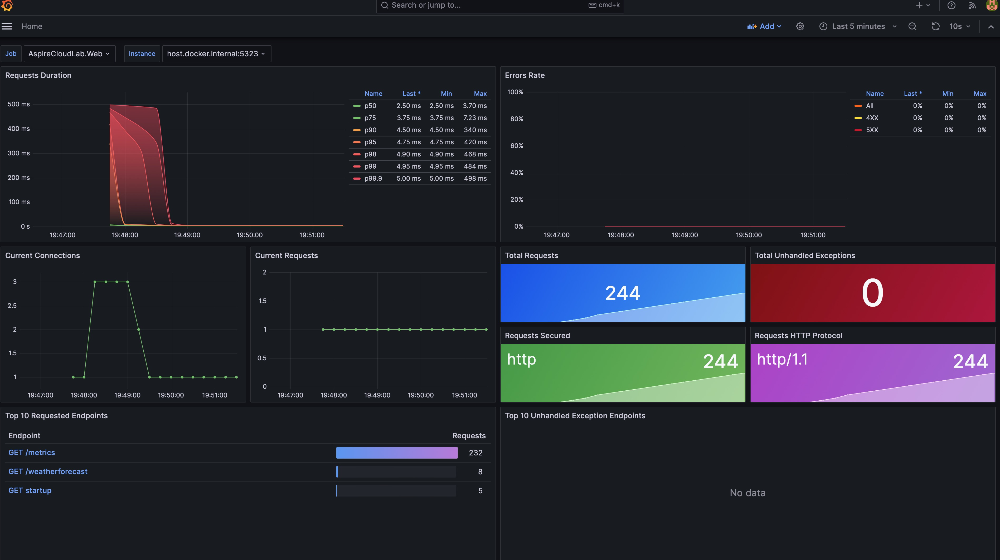

# .NET Aspire metrics sample application

This repository is a simple .NET app that shows off collecting metrics with OpenTelemetry and exporting them to Prometheus and Grafana for reporting.

**This application created via .Net Aspire project template!**



## Demonstrates

*Once new features being added, it will show up below as another header!*

### Grafana & Prometheus 

- How to configure a .NET Aspire app to export metrics to Prometheus
- How to add Prometheus and Grafana containers to a .NET Aspire app
- How to configure Prometheus and Grafana to collect and display metrics in the [.NET Grafana dashboard](https://aka.ms/dotnet/grafana-source)

## Build and Run

``` bash
dotnet run --project AspireCloudLab.AppHost
```
## Check it out
- [.Net Aspire samples](https://github.com/dotnet/aspire-samples/tree/main)
- [Observability with OpenTelemetry](https://learn.microsoft.com/en-us/dotnet/core/diagnostics/observability-with-otel)
